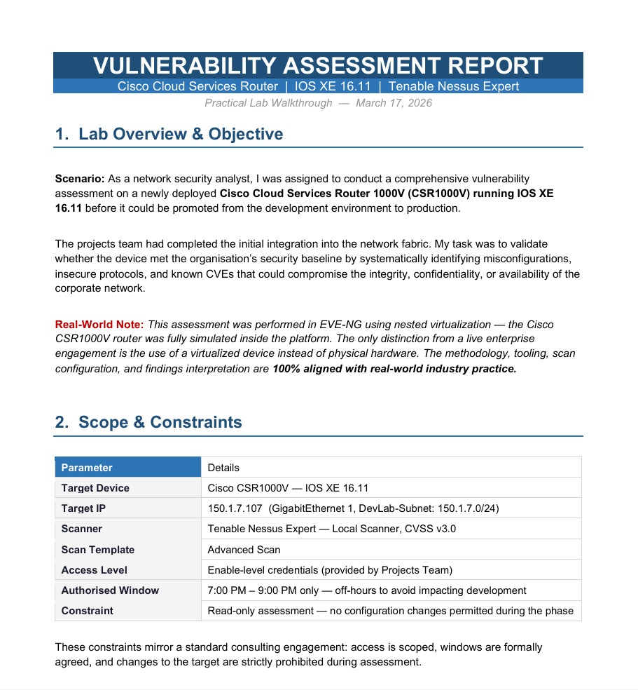
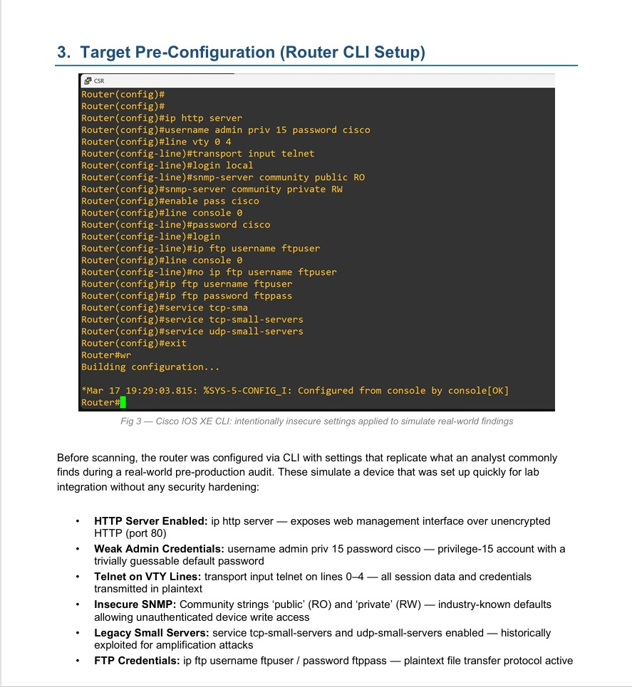
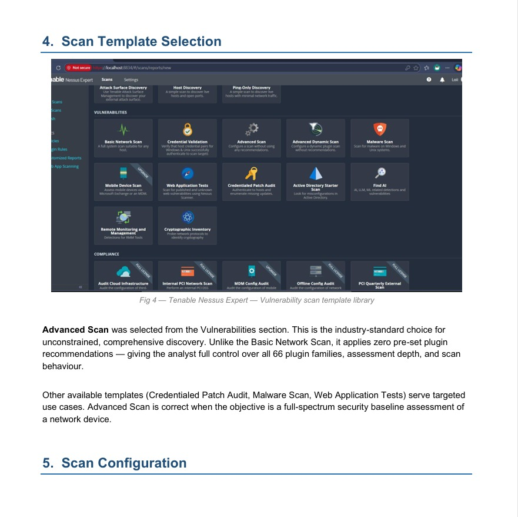
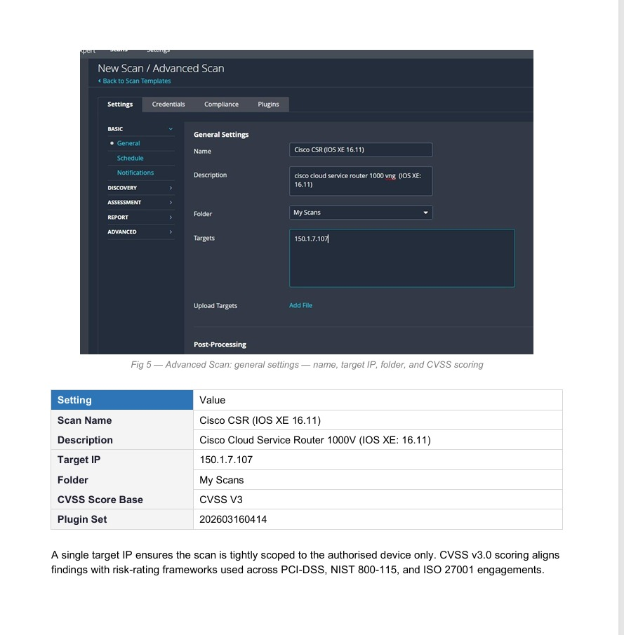
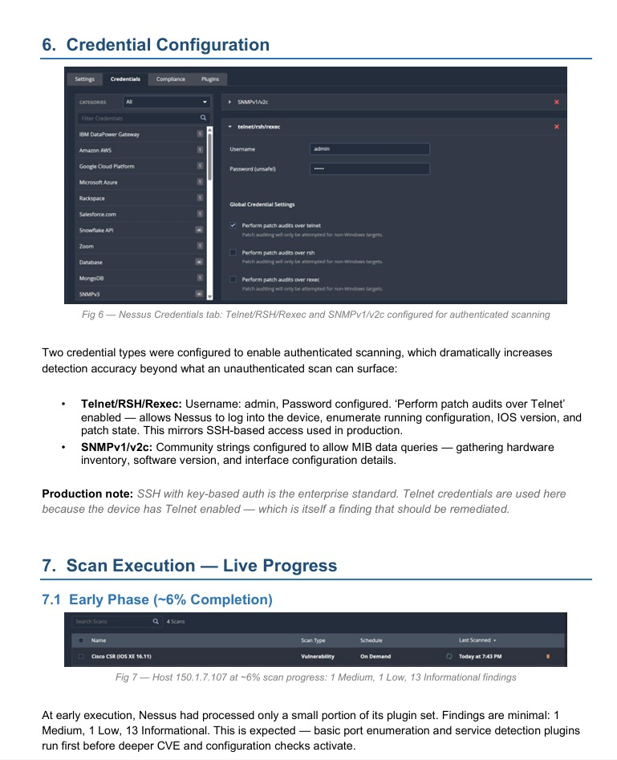
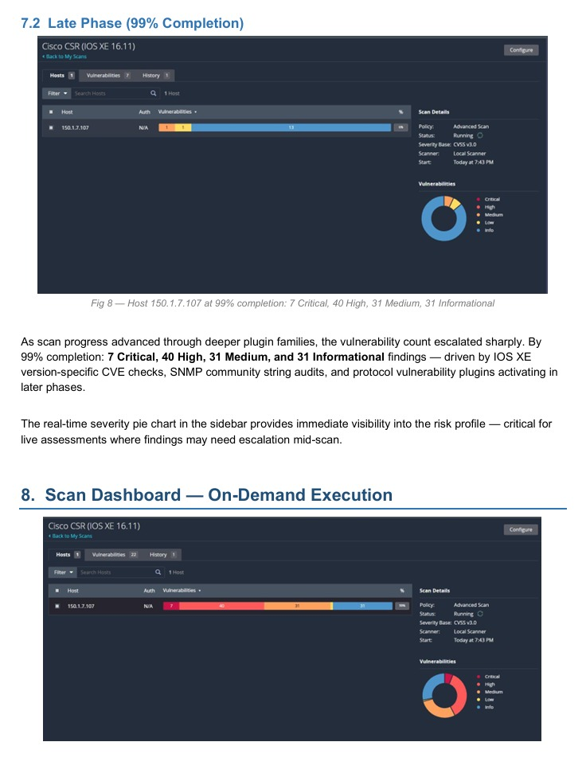
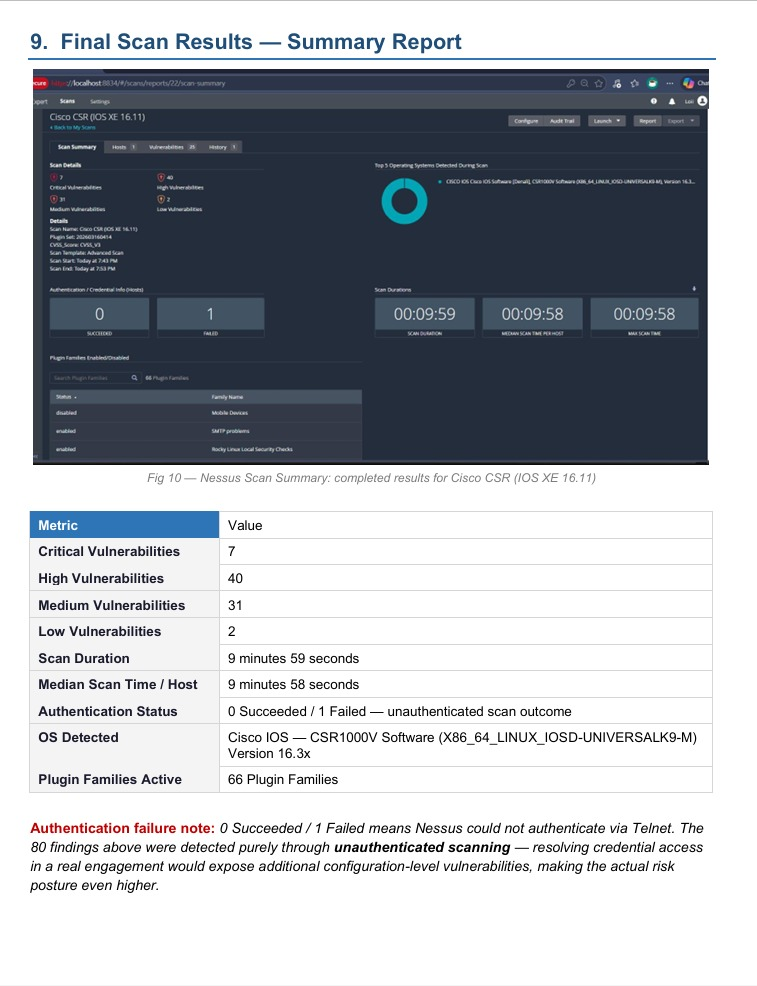
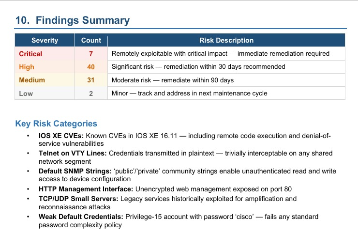

# 🔍 Vulnerability Assessment — Cisco CSR1000V IOS XE 16.11

> **Professional vulnerability assessment** conducted on a Cisco Cloud Services Router 1000V running IOS XE 16.11 using Tenable Nessus Expert — a real-world pre-production security audit identifying 80 total findings including 7 Critical and 40 High severity vulnerabilities.

**Role:** Network Security Analyst
**Organization:** Vital Medicure Labs
**Tool:** Tenable Nessus Expert
**Target:** Cisco CSR1000V — IOS XE 16.11
**Scan Type:** Advanced Scan — CVSS v3.0
**Total Findings:** 80 (7 Critical | 40 High | 31 Medium | 2 Low)
**Date:** March 17, 2026

## Lab Overview & Objective

As a Network Security Analyst at Vital Medicure Labs, this assessment was conducted on a Cisco Cloud Services Router 1000V (CSR1000V) running IOS XE 16.11 — a device that had just completed integration into the network fabric by the projects team and was being evaluated for promotion from development to production.

**Why pre-production vulnerability assessment is critical:**
Most organizations make a dangerous assumption — that a device configured by their own team is secure. In reality, network devices are almost always deployed with factory defaults or quick setups that prioritize connectivity over security. The pre-production assessment exists specifically to catch these issues before the device joins the live network where exploitation has real consequences. A single misconfigured router sitting at a network perimeter can expose the entire organization to remote code execution, credential theft, and denial-of-service attacks.

**Scope & Constraints:**

| Parameter | Details |
|-----------|---------|
| Target Device | Cisco CSR1000V — IOS XE 16.11 |
| Target IP | 150.1.7.107 (GigabitEthernet 1) |
| Scanner | Tenable Nessus Expert — CVSS v3.0 |
| Scan Template | Advanced Scan |
| Access Level | Enable-level credentials |
| Authorised Window | 7:00 PM – 9:00 PM only |
| Constraint | Read-only — no configuration changes permitted |

**Why the constraints matter:**
The off-hours scan window and read-only constraint mirror real consulting engagement Rules of Engagement. Scanning during business hours risks disrupting live traffic. Modifying configurations during assessment contaminates findings and creates legal liability. These constraints demonstrate professional engagement discipline that any enterprise security team expects.

## Step 03 — Target Pre-Configuration (Router CLI Setup)

Before scanning, the router was configured via CLI with settings that replicate what a Network Security Analyst commonly encounters during a real-world pre-production audit. These settings simulate a device that was set up quickly for lab integration without any security hardening applied.

**Why routers arrive in this state:**
Network engineers deploying routers under time pressure consistently make the same mistakes — enabling management interfaces for convenience, using default credentials to avoid lockout risk, and leaving legacy protocols active because disabling them requires additional testing. The result is a device that is fully functional from a connectivity perspective but represents a critical security liability. The Network Security Analyst's job is to surface these issues before the device goes live.

**Insecure configurations applied:**

**HTTP Server (`ip http server`):**
Enables the Cisco web management interface over unencrypted HTTP on port 80. Any attacker with network access can intercept management sessions, capture credentials, and modify device configuration. HTTPS with certificate validation is the required standard — plain HTTP has no place on a production network device.

**Weak Admin Credentials (`username admin priv 15 password cisco`):**
A privilege-15 account is the highest possible access level on IOS XE — equivalent to root on Linux. Pairing it with the password "cisco" means any attacker who can reach the management interface has full device control. This fails every password complexity policy in existence and is the single most common critical finding on network device assessments.

**Telnet on VTY Lines (`transport input telnet`):**
Telnet transmits all data — including usernames, passwords, and every command typed — in plaintext. Any attacker with access to the network segment can run a packet capture and extract complete session credentials in seconds. SSH replaced Telnet as the standard over two decades ago. Finding Telnet enabled in 2026 on a production device is an immediate critical finding.

**Default SNMP Community Strings (`public` RO / `private` RW):**
SNMP community strings function as passwords for network management queries. The strings "public" and "private" are the factory defaults known to every attacker tool and script. With RW access via the "private" string, an attacker can not only read the device's full configuration but actively modify routing tables, interface configurations, and access control lists — without any authentication beyond the community string.

**Legacy Small Servers (`service tcp-small-servers` / `service udp-small-servers`):**
These services were disabled by default in IOS for over 15 years precisely because they have been historically exploited for amplification attacks and reconnaissance. Finding them enabled indicates the configuration was either copied from a very old template or modified by someone unaware of the security implications.

**FTP Credentials (`ip ftp username ftpuser / password ftppass`):**
FTP transmits credentials in plaintext — identical problem to Telnet. Active FTP with hardcoded credentials on a router creates an unauthorized file transfer vector that attackers can exploit for configuration exfiltration or malicious image uploads.

**Key Points:**
- All misconfigurations represent real findings commonly discovered on enterprise network devices
- Every setting above violates CIS Cisco IOS Benchmark controls
- Combined, these settings give an unauthenticated attacker multiple paths to full device compromise
- Methodology mirrors real pre-production security baseline validation engagements

## Step 04 — Scan Template Selection

Tenable Nessus Expert provides multiple scan templates — each designed for a specific assessment objective. Template selection is one of the most important decisions in a vulnerability assessment because the wrong template either generates excessive noise that buries real findings or misses entire vulnerability categories entirely.

**Why Advanced Scan was selected:**
Advanced Scan was chosen from the Vulnerabilities section because it is the only template that gives the analyst complete control over all 66 Nessus plugin families with zero pre-set recommendations. Every other template pre-configures plugin selections based on assumptions about the target — assumptions that may not match the actual assessment scope.

**What each template is actually for:**

**Basic Network Scan** — designed for quick discovery of live hosts and open ports. It sacrifices depth for speed and is appropriate for initial network mapping, not security assessment. It would miss the majority of CVE checks and configuration audits performed here.

**Credential Validation** — verifies that provided credentials actually work against targets. Useful as a pre-scan check but produces no vulnerability findings on its own.

**Advanced Scan** — zero pre-set plugin recommendations. The analyst manually controls assessment depth, plugin families, safe checks, and scan behavior. This is the industry-standard choice for any comprehensive security baseline assessment. ✅ Selected.

**Credentialed Patch Audit** — focused specifically on identifying missing patches via authenticated access. Narrower scope than Advanced Scan — appropriate for patch management programs but insufficient for a full security baseline assessment.

**Web Application Tests** — targets web application vulnerabilities using Nessus Scanner. Appropriate for web application assessments but not for network device infrastructure.

**Malware Scan** — targets Windows and Unix endpoints for malware indicators. Completely inappropriate for a Cisco IOS XE device assessment.

**Why template selection matters in real engagements:**
In a consulting engagement, selecting the wrong template and missing critical findings is a professional failure that exposes the client to unmitigated risk. A penetration tester who runs a Basic Network Scan on a network device and declares it clean has not performed a vulnerability assessment — they have performed a port scan with extra steps. Advanced Scan with proper plugin configuration is the defensible, professional choice.

**Key Points:**
- 66 plugin families activated — comprehensive coverage across all vulnerability categories
- Zero pre-set recommendations — full analyst control over assessment depth
- CVSS v3.0 scoring selected — aligns with PCI-DSS, NIST 800-115, and ISO 27001 frameworks
- Advanced Scan is the correct template for full-spectrum network device security baseline assessment

## Step 05 — Scan Configuration

With the template selected, the scan was configured with precise settings that define the exact scope and scoring methodology of the assessment. Every configuration decision here has a professional rationale that mirrors real enterprise engagement practice.

**Single target IP — why scope discipline matters:**
The target was configured as a single IP address — 150.1.7.107. In a real consulting engagement, scanning outside the authorized scope — even accidentally — is a serious professional and legal violation. Rules of Engagement documents explicitly define authorized targets, and deviation from that scope can constitute unauthorized computer access regardless of intent. Configuring a single target IP enforces scope discipline at the tool level, making accidental out-of-scope scanning impossible.

**CVSS v3.0 scoring — why version matters:**
CVSS (Common Vulnerability Scoring System) v3.0 was selected as the severity base. This is critical because CVSS v2 and v3 scores for the same vulnerability can differ significantly — sometimes by multiple severity levels. Most current compliance frameworks including PCI-DSS 4.0, NIST SP 800-115, and ISO 27001 require CVSS v3.0 scoring for vulnerability assessments. Using v2 scoring in a 2026 assessment would produce findings that are misaligned with current industry risk-rating standards and potentially invalid for compliance reporting.

**Plugin Set 202603160414:**
This identifies the exact Nessus plugin database version active during the scan. Plugin sets are updated daily as new CVEs are published and new detection logic is added. Recording the plugin set version is essential for assessment reproducibility — if the same scan is run six months later with a newer plugin set, different findings may appear. The plugin set version establishes a clear point-in-time baseline for the assessment findings.

**Scan Configuration Summary:**

| Setting | Value | Rationale |
|---------|-------|-----------|
| Scan Name | Cisco CSR (IOS XE 16.11) | Clear identification for audit trail |
| Target IP | 150.1.7.107 | Single scoped target — no scope creep |
| CVSS Base | CVSS V3 | Current compliance framework standard |
| Plugin Set | 202603160414 | Point-in-time baseline for reproducibility |
| Folder | My Scans | Organized scan management |

**Key Points:**
- Single target IP enforces authorized scope at the tool level
- CVSS v3.0 aligns findings with PCI-DSS, NIST 800-115, and ISO 27001
- Plugin set version recorded for assessment reproducibility and audit trail
- Scan name clearly identifies target and IOS version for reporting purposes

  
## Step 06 — Credential Configuration

Two credential types were configured in Nessus to enable authenticated scanning — the fundamental difference between a surface-level port scan and a genuine security assessment. Authenticated scanning allows Nessus to log directly into the device, enumerate the running configuration, check IOS version against known CVE databases, and audit security settings that are completely invisible to unauthenticated probes.

**Why authenticated scanning changes everything:**
An unauthenticated scan sees what the device exposes to the network — open ports, banner information, and protocol responses. An authenticated scan sees what is actually running inside the device — the full IOS configuration, enabled services, user accounts, privilege levels, access control lists, and patch state. The difference in findings depth is dramatic. A device can appear relatively clean from the outside while running dozens of exploitable misconfigurations internally that only authenticated access reveals.

**Telnet/RSH/Rexec credentials:**
Username `admin` with password configured. The `Perform patch audits over Telnet` option was enabled — this allows Nessus to log into the device via Telnet, execute show commands, parse the IOS configuration, and compare the running IOS version against Tenable's CVE database. This mirrors what an analyst would do manually during a configuration review but automated across all 66 plugin families simultaneously.

**Why Telnet credentials are used here — and why that is itself a finding:**
SSH with key-based authentication is the enterprise standard for authenticated scanning. Telnet credentials are used here because the device has Telnet enabled as its only remote access protocol — the result of the insecure pre-configuration applied earlier. This creates an important professional observation: the credential type required for authenticated scanning directly reveals a security finding. A device that only accepts Telnet for management access has already failed a basic security baseline check before a single vulnerability is confirmed.

**SNMPv1/v2c credentials:**
Community strings were configured to allow Nessus to query the device's Management Information Base (MIB) via SNMP. MIB queries reveal hardware inventory, interface configurations, routing tables, ARP caches, and software version details — information that significantly enriches the vulnerability assessment findings. SNMPv1 and v2c transmit community strings in plaintext, which is itself a vulnerability — SNMPv3 with authentication and encryption is the required standard for any production network device.

**The authenticated vs unauthenticated finding gap:**
In this assessment, authentication ultimately failed — Nessus could not successfully authenticate via Telnet. The 80 findings discovered represent what unauthenticated scanning alone surfaces. In a real engagement where authentication succeeds, additional configuration-level vulnerabilities become visible — missing patches, insecure service configurations, and policy violations that are completely hidden from network-level probing. This means the 80 findings here represent a floor, not a ceiling, of the device's actual risk posture.

**Key Points:**
- Authenticated scanning reveals configuration-level vulnerabilities invisible to port scanning
- Telnet credentials used because SSH was not enabled — itself a critical finding
- SNMPv1/v2c community strings configured for MIB enumeration
- Authentication failure means 80 findings are the minimum — actual risk posture is higher
- SSH + SNMPv3 are the production standards that remediation should target

  ## Step 07 — Scan Execution — Live Progress

Watching a Nessus scan progress in real time provides valuable insight into how vulnerability scanners actually work — and why findings escalate dramatically as deeper plugin families activate. The progression from 6% to 99% completion tells the story of how a comprehensive vulnerability assessment unfolds.

**Early Phase (~6% Completion) — 1 Medium, 1 Low, 13 Informational:**
At 6% completion, Nessus had processed only its earliest plugin families — basic host discovery, port enumeration, and service banner grabbing. The minimal findings at this stage are completely expected. Port scanners fire first, establishing which ports are open and what services are listening. Banner grabbing plugins follow, collecting software version strings from service responses. These early findings are informational by nature — they establish the attack surface map that deeper plugins then interrogate.

**Why findings escalate sharply in later phases:**
Nessus processes plugin families in a deliberate sequence. Early plugins establish what is present. Later plugins interrogate what was found. When Nessus discovers port 23 (Telnet) is open in the early phase, it queues the entire library of Telnet vulnerability plugins for execution. When it identifies the IOS XE version from banner data, it activates all version-specific CVE checks for that exact software release. This cascading activation is why the finding count jumps from a handful of informational items at 6% to 7 Critical and 40 High findings by 99%.

**Late Phase (99% Completion) — 7 Critical, 40 High, 31 Medium, 31 Informational:**
By 99% completion the full picture had emerged. The dramatic jump in Critical and High findings compared to the early phase reflects the activation of three major plugin categories that only fire after initial reconnaissance completes:

- **IOS XE version-specific CVE checks** — Nessus identified the exact IOS XE version from service banners and activated all known CVEs for that release. IOS XE 16.11 has a significant CVE backlog including remote code execution and denial-of-service vulnerabilities.
- **SNMP community string audits** — plugins specifically targeting the default public/private community strings fired and confirmed unauthenticated read/write access to the device.
- **Protocol vulnerability plugins** — Telnet, HTTP, FTP, and legacy small server plugins all activated, each contributing findings to the High and Critical counts.

**The real-time severity pie chart:**
The sidebar severity distribution chart updates continuously during scanning — providing immediate visual triage of the emerging risk profile. In a real engagement where findings may require mid-scan escalation to the client, this real-time visibility allows the analyst to flag critical findings to stakeholders before the scan even completes. A device showing 7 Critical findings at 99% scan completion would trigger immediate escalation in any professional SOC or consulting engagement.

**Key Points:**
- Early phase findings (6%): basic port and service enumeration — expected to be minimal
- Late phase findings (99%): 7 Critical, 40 High, 31 Medium — CVE and config checks activated
- Finding escalation driven by IOS XE CVEs, SNMP audits, and protocol vulnerability plugins
- Real-time pie chart enables mid-scan escalation for critical findings
- Plugin sequencing — discovery first, exploitation checks last — is standard Nessus behavior
- Scan launched at 7:43 PM — fully within the 7-9 PM authorized assessment window

## Step 08 — Final Scan Results — Summary Report

The completed scan summary represents the definitive security posture of the Cisco CSR1000V at the time of assessment. Every metric in this report carries professional significance — from the vulnerability counts to the authentication failure note that fundamentally changes how the findings must be interpreted.

**Understanding the final numbers:**

| Metric | Value | Professional Significance |
|--------|-------|--------------------------|
| Critical Vulnerabilities | 7 | Remotely exploitable — immediate remediation required |
| High Vulnerabilities | 40 | Significant risk — 30-day remediation window |
| Medium Vulnerabilities | 31 | Moderate risk — 90-day remediation window |
| Low Vulnerabilities | 2 | Minor — next maintenance cycle |
| Total Findings | 80 | Minimum floor — authenticated scan would find more |
| Scan Duration | 9 minutes 59 seconds | Single device, full plugin set |
| Authentication Status | 0 Succeeded / 1 Failed | Unauthenticated scan outcome |
| Plugin Families Active | 66 | Full spectrum assessment |

**The authentication failure — why this is the most important line in the report:**
`0 Succeeded / 1 Failed` means Nessus could not authenticate to the device via Telnet despite credentials being configured. This is a critical professional observation that must be communicated clearly to stakeholders — the 80 findings above represent what unauthenticated network-level scanning alone surfaces. In a real engagement, resolving the authentication failure before signing off the assessment is mandatory. A signed vulnerability assessment report based on unauthenticated scanning is professionally incomplete.

**Why 80 findings in under 10 minutes matters:**
A single Advanced Scan on one network device surfaced a remediation backlog that represents weeks of engineering work to resolve properly. In enterprise environments with hundreds of network devices, each potentially in a similar state, the cumulative remediation burden is enormous. This is precisely why routine, systematic vulnerability scanning programs exist — to surface this backlog incrementally rather than discovering it all at once during a pre-production audit or, worse, after a breach.

**OS fingerprinting — what Nessus detected:**
Nessus successfully identified the operating system as `Cisco IOS — CSR1000V Software (X86_64_LINUX_IOSD-UNIVERSALK9-M) Version 16.3x`. This OS identification is significant because it activates the correct CVE database for that exact software release — ensuring that version-specific vulnerabilities are matched accurately rather than relying on generic Cisco IOS checks.

**Key Points:**
- 7 Critical findings require immediate remediation before production promotion
- 80 total findings from unauthenticated scan — authenticated scan would surface more
- Authentication failure must be resolved before assessment can be signed off
- 66 plugin families confirm full-spectrum assessment coverage
- 10-minute scan duration demonstrates operational efficiency of automated VA tooling
- OS fingerprinting enabled accurate version-specific CVE matching

## Step 09 — Findings Summary & Key Risk Categories

The findings summary translates raw vulnerability counts into actionable risk categories — the professional deliverable that allows network engineers and management to understand not just how many vulnerabilities exist, but what they mean, what an attacker can do with them, and in what order they must be addressed.

**Severity breakdown and remediation timelines:**

| Severity | Count | Risk Description | Remediation Timeline |
|----------|-------|-----------------|---------------------|
| Critical | 7 | Remotely exploitable with critical impact | Immediate — before production promotion |
| High | 40 | Significant risk to device and network | Within 30 days |
| Medium | 31 | Moderate risk requiring planned remediation | Within 90 days |
| Low | 2 | Minor — informational risk | Next maintenance cycle |

**Key Risk Categories — deep technical analysis:**

**IOS XE CVEs (Critical/High):**
IOS XE 16.11 carries a documented CVE backlog that includes remote code execution and denial-of-service vulnerabilities. These are not theoretical risks — they are publicly disclosed vulnerabilities with published proof-of-concept exploit code in many cases. A router running unpatched IOS XE at the network perimeter is a known-exploitable target. The remediation is an IOS XE upgrade to the current recommended release, which Cisco publishes through its PSIRT advisories. In a real engagement this would be the first recommendation in the formal report — patch the operating system before addressing configuration findings.

**Telnet on VTY Lines (Critical):**
Telnet on network device management interfaces is a critical finding in any assessment framework. The VTY lines (Virtual Terminal Lines 0-4) are the remote management access points for the router. With Telnet enabled, every management session — every command typed, every configuration change reviewed, every credential used — is transmitted in plaintext across the network. An attacker with access to any network segment between the administrator and the router can capture these sessions trivially using tools like Wireshark. The remediation is replacing `transport input telnet` with `transport input ssh` on all VTY lines and generating RSA keys for SSH operation.

**Default SNMP Community Strings (Critical):**
The community strings `public` (read-only) and `private` (read-write) are the factory defaults for SNMP and are included in every network scanner, exploitation framework, and attacker script ever written. With read-write access via the `private` community string, an attacker does not need to authenticate to the CLI at all — they can query and modify the device configuration directly through SNMP. This includes modifying routing tables to redirect traffic, changing interface configurations, and extracting the complete device configuration including all credentials. Remediation requires removing these community strings entirely and migrating to SNMPv3 with authentication and encryption.

**HTTP Management Interface (High):**
The Cisco web management interface running over unencrypted HTTP on port 80 exposes every management session to interception. Unlike Telnet where an attacker needs to be on the network path, HTTP management sessions can be intercepted anywhere between the browser and the device. The remediation is disabling `ip http server` and enabling `ip http secure-server` for HTTPS-only management access.

**TCP/UDP Small Servers (High):**
These legacy diagnostic services — echo, chargen, daytime, and discard — were disabled by default in IOS for over 15 years because they have been exploited for amplification attacks, traffic reflection, and network reconnaissance. Their presence indicates the configuration was not reviewed against any current security baseline. Remediation is `no service tcp-small-servers` and `no service udp-small-servers`.

**Weak Default Credentials (Critical):**
A privilege-15 account — the highest possible access level on IOS XE — protected by the password `cisco` represents complete device compromise for any attacker who can reach the management interface. Privilege 15 provides unrestricted access to every IOS command including those that modify routing, reset interfaces, erase configurations, and establish unauthorized VPN tunnels. This finding alone justifies blocking the device from production promotion until resolved.

**Key Points:**
- 7 Critical findings collectively provide multiple paths to complete device compromise
- IOS XE patch upgrade is the highest-priority remediation — addresses CVE backlog immediately
- Telnet replacement with SSH closes the plaintext credential interception vector
- SNMP community string replacement with SNMPv3 eliminates unauthenticated device write access
- All findings map to CIS Cisco IOS Benchmark controls and NIST SP 800-115 requirements
- Device should not be promoted to production until all Critical and High findings are resolved

## Key Takeaways

**Authenticated scanning matters:**
Unauthenticated scanning alone surfaced 80 vulnerabilities. Resolving credential access would expose additional configuration-level risks invisible to network-level probing. In a real engagement, authentication failures must be resolved before the assessment can be signed off — an unauthenticated scan report is professionally incomplete.

**Default credentials are always a critical finding:**
Privilege-15 accounts with passwords like `cisco` or `admin` are the most common, highest-impact finding on network device assessments. They represent complete device compromise for any attacker who can reach the management interface — and on a network-connected router, that is potentially anyone on the internet.

**Telnet and SNMPv1/v2c are obsolete:**
Both protocols transmit authentication data in plaintext. SSH and SNMPv3 with encryption have been the expected security baseline for over a decade. Finding either protocol enabled in a production environment is an immediate critical finding that blocks security sign-off.

**10 minutes, 80 findings:**
A single Advanced Scan on one device surfaces a remediation backlog representing weeks of engineering work. In enterprise environments with hundreds of network devices, systematic vulnerability scanning programs are the only practical way to manage this exposure at scale.

**No device should reach production without security validation:**
Every finding in this report existed on the device before a single packet was transmitted from Nessus. They were introduced during initial configuration and would have remained invisible — and exploitable — indefinitely without a structured vulnerability assessment process.

---

## Final Assessment Summary

| Category | Result |
|----------|--------|
| Critical Vulnerabilities | 7 — immediate remediation required |
| High Vulnerabilities | 40 — 30-day remediation window |
| Medium Vulnerabilities | 31 — 90-day remediation window |
| Total Findings | 80 (unauthenticated — actual posture higher) |
| Production Recommendation | ❌ DO NOT PROMOTE — Critical findings unresolved |
| Compliance Frameworks | PCI-DSS, NIST SP 800-115, ISO 27001, CIS Cisco IOS Benchmark |

---

## Skills Demonstrated

`Vulnerability Assessment` `Tenable Nessus Expert` `Cisco IOS XE` `Network Security`
`CVSS v3.0 Scoring` `CVE Analysis` `SNMP Security` `Credential Management`
`Authenticated Scanning` `Risk Prioritization` `Security Baseline Assessment`
`PCI-DSS` `NIST SP 800-115` `CIS Benchmark` `Remediation Planning`

---

*Ayesha | Network Security Analyst | Vital Medicure Labs | March 17, 2026*
  
